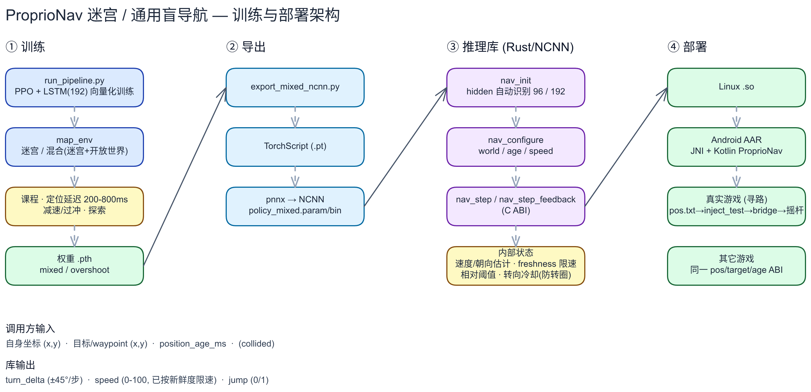

# ProprioNav

仅依赖**自身坐标 + 目标坐标 + 定位年龄**的盲导航策略，配套一个有状态的
C/Rust（NCNN）部署库。

- 观测：13 维延迟位置量（目标相对位置、方位、速度、卡顿、碰撞触觉、定位年龄等）。
- 网络：LSTM + actor。hidden 维在 `nav_init` 时**从模型 `.param` 自动识别**，
  同一份 `.so` 可加载 hidden 96（V5）与 192（迷宫/通用混合）两种模型。
- 输出：转向、速度、跳跃，以及**库内部维护的绝对摇杆角** `abs_angle`。
- 库内置：延迟外推、由位移估计运动方向、碰撞/停滞推断、标定、防转圈
  （相对步幅阈值 + 转向冷却）、脱困与跳跃冷却。
- 游戏尺度（地图边长/最大年龄/陈旧阈值/最大速度）运行时可配，无需重编。

> **指标**：V5 Hard（1024 局）成功率 **96.7%**，成功局中位 **52 步**，中位路径比 **1.09**。
> 迷宫/通用混合策略：开放世界约 **94%**，迷宫（≤1/4 距离）约 **30–40%**。

---

## 系统架构 (System Architecture)



> **可编辑源文件**：[docs/architecture_maze_nav.excalidraw](docs/architecture_maze_nav.excalidraw)
> （生成脚本 `docs/gen_architecture.py`）。

---

## 核心 C ABI 接口

头文件位于 [proprionav.h](ncnn_rust/include/proprionav.h)：

```c
/* 加载模型并建会话；hidden 维自动识别。失败返回 NULL。 */
void* nav_init(const char* param_path, const char* bin_path);

/* 运行时可配游戏尺度；各字段 <= 0 表示保持默认（V5: 2250/500/1000/500）。 */
int nav_configure(void* nav,
                  float world_size, float age_max_ms,
                  float stale_ms, float max_speed);

/* 单步：碰撞由库按"相对自身步幅"推断。 */
int nav_step(
    void* nav,
    float pos_x, float pos_y,
    float target_x, float target_y,
    float position_age_ms,
    float* turn_delta,   /* 相对上一运动方向，±π/4 */
    float* speed,        /* 0–100，已按定位新鲜度限速 */
    int*   jump,         /* 0/1 */
    float* abs_angle     /* 库维护的绝对摇杆角（弧度, y 向上, 0=+x/右），可为 NULL */
);

/* 宏输出变体：输入与 nav_step 完全相同，多返回当前脱困宏 id。
 * 碰撞一律由库内部推断（相对自身步幅），没有调用方传入的碰撞标志。 */
int nav_step_feedback(
    void* nav,
    float pos_x, float pos_y,
    float target_x, float target_y,
    float position_age_ms,
    float* turn_delta, float* speed, int* jump,
    int* macro,          /* 可为 NULL / 无宏头的模型传 NULL */
    float* abs_angle
);

void nav_free(void* nav);
```

调用方每个决策周期反馈当前位置、当前 waypoint 和定位观测年龄即可；到达 waypoint
后切换到下一个 waypoint，最终目标由调用方管理。

**关于 `abs_angle`**：它是可直接写进摇杆的**绝对世界角**（y 向上，0 = 右，π/2 = 上）。
首次调用用「当前点→目标」的方位角初始化（起手即朝目标，免去开头试探），之后每步
累加策略/脱困给出的相对转角。**用了 `abs_angle` 就不要再自己累加 `turn_delta`**；
两者同时返回只是给调用方选择权。

---

## Android arm64-v8a

仓库包含可直接接入的 Android AAR、Kotlin 封装和最小示例应用，支持 Android 7.0
（API 24）及以上：

- `android/dist/proprionav-mixed-arm64.aar`：Release AAR（迷宫/通用模型，hidden 192），含模型、JNI、arm64 SO 与 C++ 运行时。
- `android/dist/proprionav-sample-arm64-debug.apk`：可安装的最小示例 APK。
- `android/proprionav/`：AAR 源码。
- `android/sample/`：Kotlin 接入范例。

```kotlin
val nav = ProprioNav.fromAssets(context)
val action = nav.step(playerX, playerY, goalX, goalY, positionAgeMs)

// absAngle 是库维护的绝对摇杆角（弧度）——直接驱动摇杆，不要再累加 turnDelta。
aim(action.absAngle)
setSpeed(action.speed)
if (action.jump) jump()

nav.close()
```

完整构建与接入说明见 [android/README.md](android/README.md)。

---

## 常用命令

### 1. 训练与评估（迷宫 / 通用）

```bash
# 程序化生成迷宫（已提交 maze_grid.npz，可跳过）
python -m map_env.generate_maze --seed 0

# 迷宫 + 开放世界混合、纯坐标、hidden 192
python run_pipeline.py --train-only --no-training-video \
  --maze-grid map_env/maze_grid.npz --maze-mix-open-world \
  --hidden-dim 192 --actor-width 96 --rollout-steps 256 --num-envs 2048 \
  --position-age-min-ms 200 --position-age-max-ms 800 --position-stale-ms 1200 \
  --weights-name policy_weights_mixed.pth

# 2D 仿真指标评估
python pipeline_out/eval_2d_metrics.py \
  --weights pipeline_out/policy_weights_mixed.pth --episodes 1024
```

### 2. 导出 NCNN 与编译动态库

```bash
# 导出 FP32 NCNN 模型（迷宫/通用, hidden 192）
python pipeline_out/export_mixed_ncnn.py

# 编译 libncnn_rust.so
RUSTFLAGS="-C linker=/usr/bin/gcc" cargo build --manifest-path ncnn_rust/Cargo.toml --release
cp ncnn_rust/target/release/libncnn_rust.so pipeline_out/
```

### 3. 对齐 / 冒烟验证

```bash
# 高层 ABI（nav_init / nav_configure / nav_step / nav_step_feedback / nav_free
# 以及 abs_angle 的"首步=目标方位角、其后累加"语义）
python pipeline_out/test_nav_api.py
```

低层单步推理（`run_inference`）与 PyTorch 的对齐脚本属于早期版本，已随 V3/V4
清理移除，可从 git 历史取回。

---

## 目录结构

```text
.
├── docs/                               # 架构图 (png/svg/excalidraw + 生成脚本)
├── run_pipeline.py                     # GPU 向量化训练与评估
├── render_eval10_concat.py             # 视频渲染工具
├── map_env/                            # 迷宫 / 混合环境与模型文档
├── android/
│   ├── dist/                           # Release AAR 与示例 APK
│   ├── proprionav/                     # JNI/Kotlin Android 库
│   └── sample/                         # 最小示例应用
├── ncnn_rust/
│   ├── include/proprionav.h            # 公共 C ABI 头文件
│   └── src/lib.rs                      # 有状态导航核心引擎
├── pipeline_out/
│   ├── policy_mixed.ncnn.param/.bin    # 迷宫/通用 FP32 NCNN 模型
│   ├── policy_weights_mixed.pth        # 对应 PyTorch 权重
│   ├── delayed_belief.py               # 延迟位置信念估计（viewer 复用）
│   └── test_nav_api.py                 # C ABI 冒烟测试
└── examples/
    └── fastapi_server.py               # Python RESTful HTTP 桥接服务
```

更详细的迷宫环境说明、训练参数与结果见 [map_env/README.md](map_env/README.md)。
