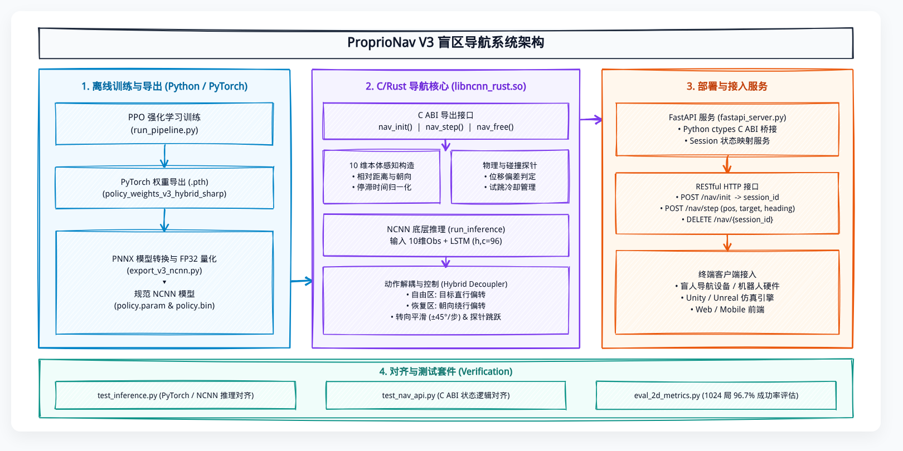

# ProprioNav

仅依赖自身位置、目标位置和人物朝向的盲区导航策略。当前 V3 使用 10 维本体感知观测和 LSTM，空旷区贴近目标直行，碰撞或停滞后切换为朝向相对绕行，由 C/Rust 共享库处理连续位移反馈与跳跃控制。

> **核心指标 (1024 局 Hard 仿真评估)**: 成功率 **96.7%**，成功局中位 **52 步**，中位路径比 **1.09**。

---

## 系统架构 (System Architecture)



> **可编辑源文件**: 架构图源文件存放于 [architecture.excalidraw](architecture.excalidraw)，可在 IDE 或 Excalidraw 中直接编辑。

---

## 核心 C ABI 接口

头文件位于 [proprionav.h](ncnn_rust/include/proprionav.h)：

```c
void* nav_init(const char* param_path, const char* bin_path);

int nav_step(
    void* nav,
    float pos_x, float pos_y,
    float target_x, float target_y,
    float heading,
    float* direction, float* speed, int* jump
);

void nav_free(void* nav);
```

调用方每个决策周期反馈当前位置和朝向即可。共享库内部自动维护 LSTM 隐状态、碰撞/停滞推断、Hybrid 绕行与跳跃冷却。

---

## Android arm64-v8a

仓库包含可直接接入的 Android AAR、Kotlin 封装和最小示例应用，支持 Android 7.0
（API 24）及以上：

- `android/dist/proprionav-v3-arm64.aar`：Release AAR，内含模型、JNI、arm64 SO 与 C++ 运行时。
- `android/dist/proprionav-sample-arm64-debug.apk`：可安装的最小示例 APK。
- `android/proprionav/`：AAR 源码。
- `android/sample/`：Kotlin 接入范例。

```kotlin
val nav = ProprioNav.fromAssets(context)
val action = nav.step(playerX, playerY, goalX, goalY, headingRadians)

move(action.direction, action.speed)
if (action.jump) jump()

nav.close()
```

完整构建与接入说明见 [android/README.md](android/README.md)。

---

## 常用命令

### 1. 训练与评估
```bash
# 从头训练模型
python run_pipeline.py --train-only --episodes 1000000 --weights-name policy_weights_candidate.pth

# 1024 局 Hard 场景批量评估
python pipeline_out/eval_2d_metrics.py --weights pipeline_out/policy_weights_v3_hybrid_sharp.pth --action-mode hybrid --hybrid-free-max-deg 10 --obstacle-signal-mode jump_probe --jump-controller probe --episodes 1024

# 导出评估视频
python run_pipeline.py --eval-only --no-play
```

### 2. 导出 NCNN 与编译 C 动态库
```bash
# 导出 FP32 NCNN 模型
python pipeline_out/export_v3_ncnn.py
pnnx pipeline_out/policy_v3.pt 'inputshape=[1,10],[1,96],[1,96]' fp16=0
cp pipeline_out/policy_v3.ncnn.param pipeline_out/policy.param
cp pipeline_out/policy_v3.ncnn.bin pipeline_out/policy.bin

# 编译 C/Rust 动态库 libncnn_rust.so
RUSTFLAGS="-C linker=/usr/bin/gcc" cargo build --manifest-path ncnn_rust/Cargo.toml --release
cp ncnn_rust/target/release/libncnn_rust.so pipeline_out/
```

### 3. 对齐验证
```bash
python pipeline_out/test_inference.py  # PyTorch vs NCNN 底层推理对齐
python pipeline_out/test_nav_api.py     # C ABI 状态对齐
```

---

## 目录结构

```text
.
├── architecture.excalidraw            # Excalidraw 架构图源文件
├── architecture_hand_drawn.png        # 手绘风格系统架构图
├── run_pipeline.py                    # GPU 向量化训练与评估
├── render_eval10_concat.py            # 视频渲染工具
├── android/
│   ├── dist/                           # AAR 与示例 APK
│   ├── proprionav/                     # JNI/Kotlin Android 库
│   └── sample/                         # 最小示例应用
├── ncnn_rust/
│   ├── include/proprionav.h           # 公共 C ABI 头文件
│   └── src/lib.rs                     # 有状态导航核心引擎
├── pipeline_out/
│   ├── policy.param / policy.bin      # FP32 NCNN 模型
│   ├── test_inference.py              # 底层推理测试
│   └── test_nav_api.py                # C ABI 测试
└── examples/
    └── fastapi_server.py               # Python RESTful HTTP 桥接服务
```
